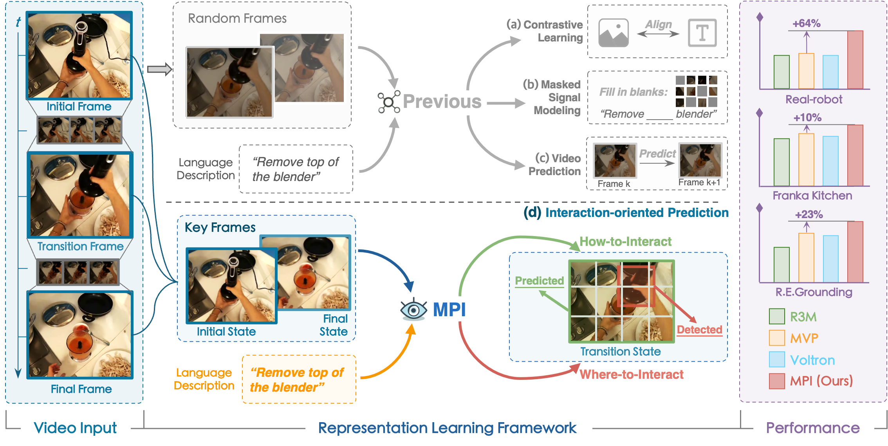
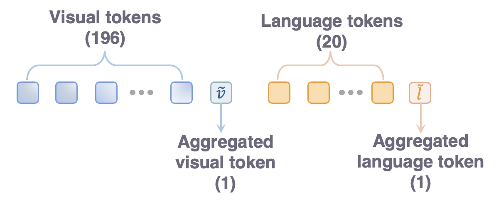
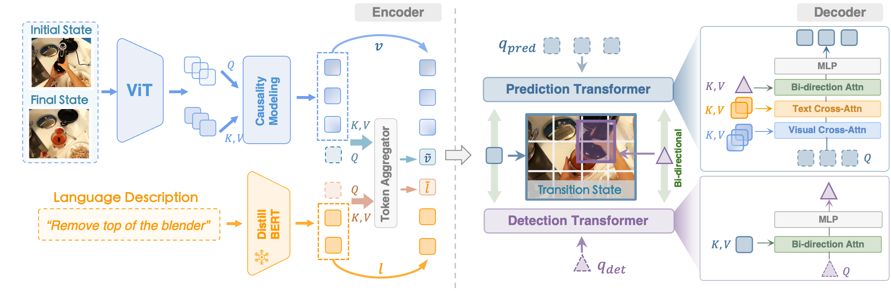

# Learning Manipulation by Predicting Interaction (MPI)


<h3 align="center">
  <a href="https://opendrivelab.com/MPI/">Project Website</a> |
  <a href="https://arxiv.org/abs/2406.00439">Paper</a> |
  RSS 2024
</h3>



## :fire: Highlight

​**MPI** is an interaction-oriented representation learning method towards robot manipulation:

- Instruct the model towards predicting transition frames and detecting manipulated objects with keyframes.
- Foster better comprehension of “how-to-interact” and “where-to-interact”.
- Acquire more informative representations during pre-training and achieve evident improvement across downstream tasks.

## :movie_camera: Demo
Real-world robot experiments on complex kitchen environment.

<table class="center">
<tr>
  <td style="text-align:center;"><b>Take the spatula off the shelf (2x speed)</b></td>
  <td style="text-align:center;"><b>Lift up the pot lid (2x speed)</b></td>
</tr>
<tr>
  <td><video src="https://github.com/OpenDriveLab/MPI/assets/33364294/1652a279-6ec2-4150-97fd-4144b6a55914" autoplay></td>
  <td><video src="https://github.com/OpenDriveLab/MPI/assets/33364294/818025c9-63fe-4889-af54-1a5e79fd5b8a" autoplay></td>
</tr>
<tr>
  <td style="text-align:center;"><b>Close the drawer (2x speed)</b></td>
  <td style="text-align:center;"><b>Put pot into sink (2x speed)</b></td>
</tr>
<tr>
  <td><video src="https://github.com/OpenDriveLab/MPI/assets/33364294/375edd93-cca6-447a-bc21-ed9d8d8bda77" autoplay></td>
  <td><video src="https://github.com/OpenDriveLab/MPI/assets/33364294/91697ec0-2414-424e-b1e8-821ffccc71b3" autoplay></td>
</tr>
</table>

## :rocket: News

- **[2024/05/31]** We released the implementation of pre-training and evaluation on Referring Expression Grounding task. 
- **[2024/06/04]** We released our [paper](https://arxiv.org/abs/2406.00439) on arXiv.
- **[2024/06/16]** We released the model weights.
- **[2024/07/05]** We released the evaluation code on Franka Kitchen environment.

## Getting Started <a name="start"></a>
- [Installation](#installation)
- [Get representation](#representation)
- [Pre-training](#pretraining)
- [Evaluation](#evaluation)

### Installation <a name="installation"></a>

Step 1. Clone and setup MPI dependency:
```bash
git clone https://github.com/OpenDriveLab/MPI
cd MPI
pip install -e .
```

Step 2. Prepare the language model, you may download DistillBERT from [HuggingFace](https://huggingface.co/distilbert/distilbert-base-uncased)

### Get representation <a name="representation"></a>

#### :luggage: Checkpoints
To directly utilize MPI for extracting representations, please download our pre-trained weights:
|Model|Checkpoint|Params.|Config|
|:------:|:------:|:------:|:------:|
|MPI-Small|[GoogleDrive](https://drive.google.com/file/d/1N7zCWi9ztrcCHsm4xhAA1hsnviv2gdvn/view?usp=drive_link)|22M|[GoogleDrive](https://drive.google.com/file/d/1zG9O9-F86hJowxCUrgpVFfanbIjwn9Tp/view?usp=sharing)|
|MPI-Base|[GoogleDrive](https://drive.google.com/file/d/1JCpnxYGrrML8hdnMh0UeK6p_XuLNhmdm/view?usp=drive_link)|86M|[GoogleDrive](https://drive.google.com/file/d/1NYiPd72DEjVmErxg5lEHeRxWD0jJKz-0/view?usp=sharing)|


Your directory tree should look like this: 
```
checkpoints
├── mpi-small
|   |—— MPI-small-state_dict.pt  
|   └── MPI-small.json
└── mpi-base
    |—— MPI-base-state_dict.pt    
    └── MPI-base.json
```

#### Obtain representation from pretrained MPI
We provide a example code [get_representation.py](./get_representation.py) to show how to obtain the pre-trained MPI features. The MPI encoder by default requires two images as input. In downstream tasks, we simply replicate the current observation to ensure compatibility.

The following diagram presents the composition and arrangement of the extracted tokens:


### Pre-training <a name="pretraining"></a>
#### Prepare Pre-training Dataset
Download [Ego4D](https://ego4d-data.org/docs/start-here/) Hand-and-Object dataset:
```
# Download the CLI
pip install ego4d
# Select Subset Of Hand-and-Object
python -m ego4d.cli.cli --output_directory=<path-to-save-dir> --datasets clips annotations  --metadata --version v2 --benchmarks FHO
```
Your directory tree should look like this: 
```
$<path-to-save-dir>
├── ego4d.json
└── v2
    |—— annotations  
    └── clips
```
Preprocess dataset for pre-training MPI:
```
python prepare_dataset.py --root_path <path-to-save-dir>/v2/
```

#### Pre-training script

Pre-train MPI on 8 Nvidia A100 GPUs:

```bash
torchrun --standalone --nnodes 1 --nproc-per-node 8 pretrain.py
```

### Evaluation <a name="evaluation"></a>
#### Referring Expression Grounding
Step 1. Prepare the OCID-Ref dataset following this [repo](https://github.com/lluma/OCID-Ref). Then put the dataset to 

```bash
./mpi_evaluation/referring_grounding/data/langref
```

Step 2. Initiate evaluation with
```bash
python mpi_evaluation/referring_grounding/evaluate_refer.py test_only=False iou_threshold=0.5 lr=1e-3 \
model=\"mpi-small\" \
save_path=\"MPI-Small-IOU0.5\" \
eval_checkpoint_path=\"path_to_your/MPI-small-state_dict.pt\" \
language_model_path=\"path_to_your/distilbert-base-uncased\" \
```

or you can simply use 
```bash
bash mpi_evaluation/referring_grounding/eval_refer.sh
```

#### Franka Kitchen
Following the [guidebook](./mpi_evaluation/franka_kitchen/README.MD) to setup Franka Kitchen environment and download the expert demonstrations.

Evaluating visuomotor control on Franka Kitchen environment with **25** expert demonstration.
```bash
CUDA_VISIBLE_DEVICES=0 PYTHONPATH=mpi_evaluation/franka_kitchen/MPIEval/core python mpi_evaluation/franka_kitchen/MPIEval/core/hydra_launcher.py hydra/launcher=local hydra/output=local env="kitchen_knob1_on-v3" camera="left_cap2" pixel_based=true embedding=ViT-Small num_demos=25 env_kwargs.load_path=mpi-small bc_kwargs.finetune=false job_name=mpi-small seed=125 proprio=9
```

## Citation

If you find the project helpful for your research, please consider citing our paper:

```bibtex
@article{zeng2024learning,
  title={Learning Manipulation by Predicting Interaction},
  author={Zeng, Jia and Bu, Qingwen and Wang, Bangjun and Xia, Wenke and Chen, Li and Dong, Hao and Song, Haoming and Wang, Dong and Hu, Di and Luo, Ping and others},
  journal={arXiv preprint arXiv:2406.00439},
  year={2024}
}
```

## Acknowledgment
The code of this work is built upon [Voltron](https://github.com/siddk/voltron-robotics) and [R3M](https://github.com/facebookresearch/r3m). Thanks for their open-source work!
